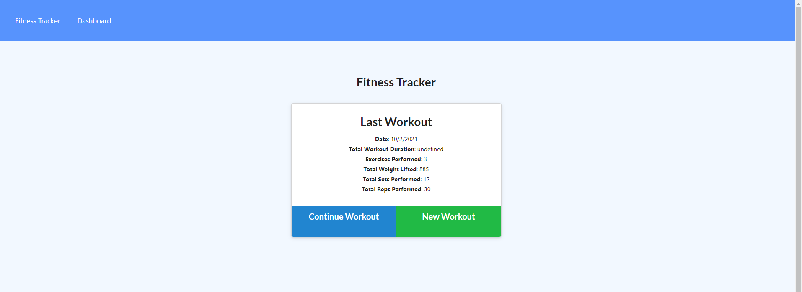
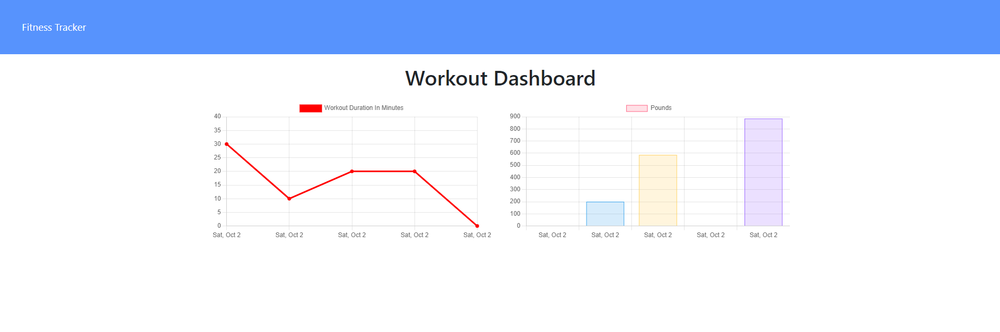
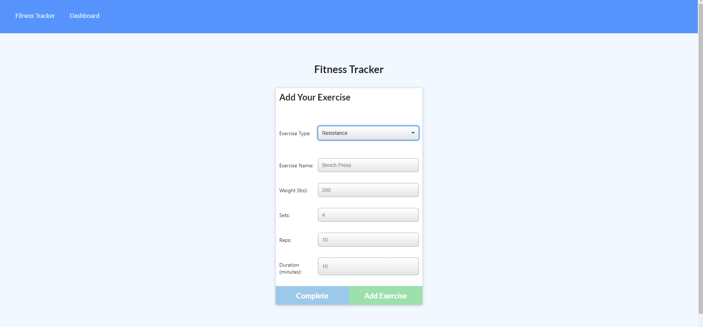

# Fitness Tracker

An application that tracks your exercises. We can add exercises and look at our statistics over time in terms of the duration and the amount of weight carried. 

## User Story

* As a user, I want to be able to view create and track daily workouts. I want to be able to log multiple exercises in a workout on a given day. I should also be able to track the name type, weight, sets, reps, and duration of exercise. If the exercise is a cardio exercise, I should be able to track my distance traveled.

## Deployed

[Link to the application](https://chandtheman1-fitness-tracker.herokuapp.com/)

## Technologies Used

- Node.js
- NPM Libraries
    - Express
    - Mongoose
    - Morgan
    - Dotenv
- MongoDB Atlas

## How to use it 

`npm install` to install all dependencies

`mongod` to run the local database

`npm run seed` to seed database with examples

`npm run start` to start the application locally

## Images

